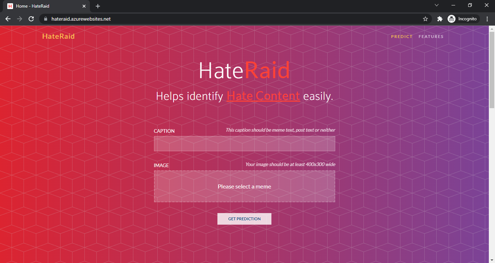
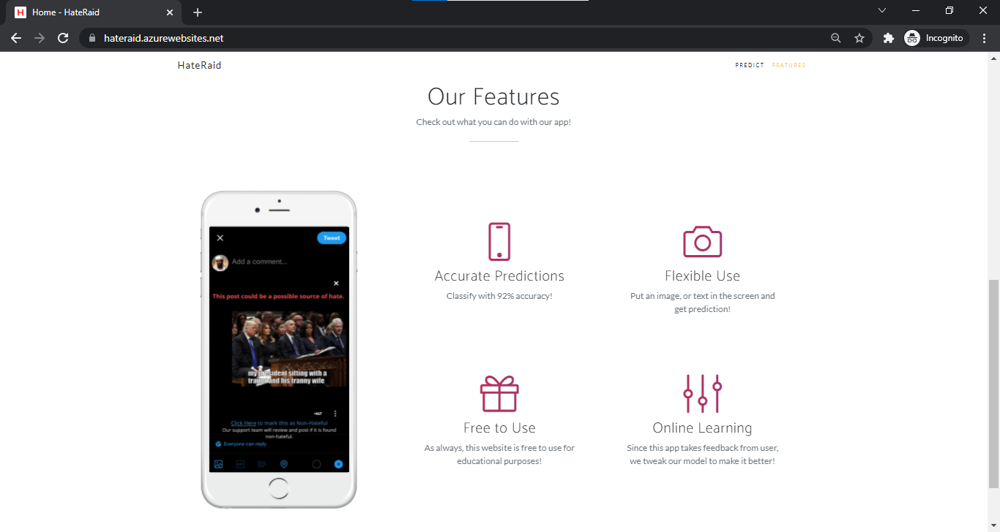
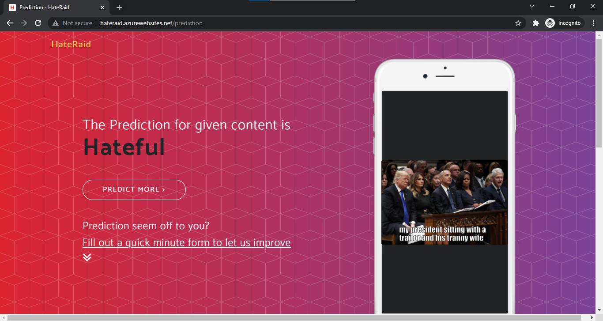
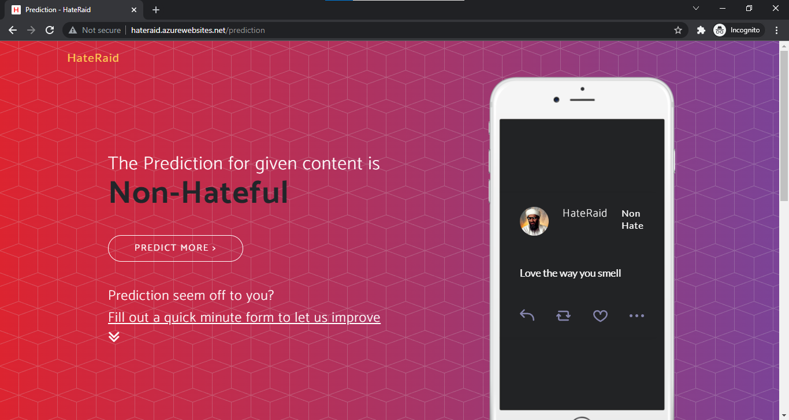

# HateRaid - Microsoft Imagine Cup Submission

HateRaid - Helps identify Hate Content easily

## Deployment
Deployed Web Application: [HateRaid](http://hateraid.azurewebsites.net/)

## Installation
Clone the repository.
```bash
git clone https://github.com/shivamtawari/HateRaid.git
```

Use the package manager [pip](https://pip.pypa.io/en/stable/) to install requirements.

```bash
pip install -r requirements.txt
```

## Usage

Download Model Checkpoint [here](https://drive.google.com/drive/folders/1BdSbvu9BGm1lA6nE8eTxmqDUzPrlCXsl) and place in "_models_" directory.
Then run

```python
python app.py
```


## Screenshots
|    |    |
| ---| ---|
||  |
||  |

## Contributing
Pull requests are welcome. For major changes, please open an issue first to discuss what you would like to change.

Please make sure to update tests as appropriate.

## License
[MIT](https://choosealicense.com/licenses/mit/)
